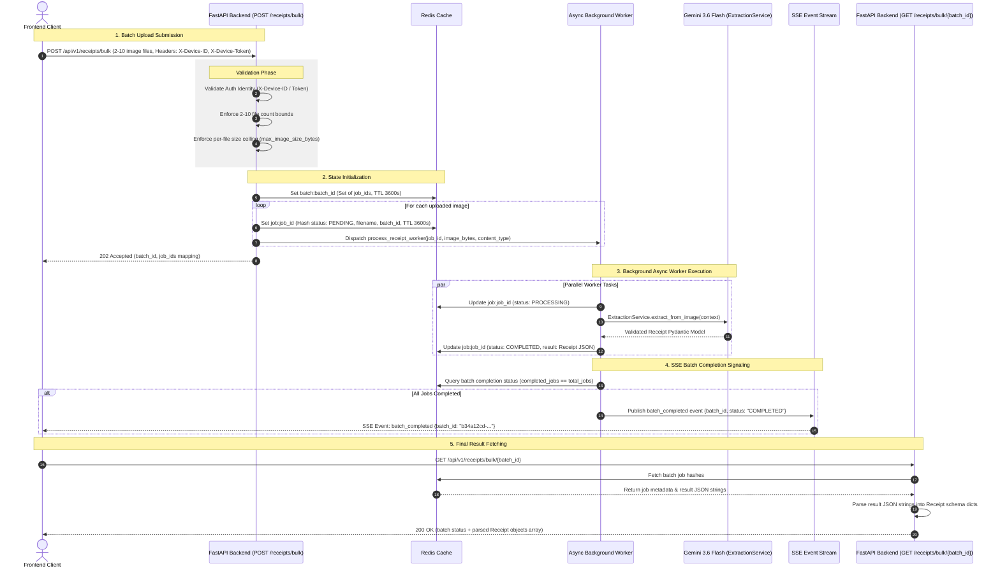

# API Specification Document

This document lists all endpoints available in **Receipt Logging Backend v1**, including HTTP methods, authentication headers, request payloads, and return schemas.

---

## Base URL & Authentication

- **Base URL**: `/api/v1`
- **Session Identity Headers**:
  - `X-Device-ID`: Hardware device identifier (Required for device/user session)
  - `X-Device-Token`: Cryptographic device token (Required for device verification)
  - `X-User-ID`: Authenticated User ID (Optional for guest mode, required for user-protected routes)

---

## Table of Contents
1. [Scanning (`tags=["Scanning"]`)](#1-scanning-tagsscanning)
2. [Receipts (`tags=["Receipts"]`)](#2-receipts-tagsreceipts)
3. [Users (`tags=["Users"]`)](#3-users-tagsusers)
4. [Devices (`tags=["Devices"]`)](#4-devices-tagsdevices)
5. [Chat (`tags=["Chat"]`)](#5-chat-tagschat)
6. [Health (`tags=["Health"]`)](#6-health-tagshealth)
7. [Data Schemas](#7-data-schemas)

---

## 1. Scanning (`tags=["Scanning"]`)

### `POST /api/v1/scan/parse`
Extract structured receipt details from a single image using Gemini 3.5 Flash.

- **Content-Type**: `multipart/form-data`
- **Request Body**:
  - `image`: File (JPEG, PNG, WEBP, etc.)
- **Response Schema** (`200 OK`): `ScanResponse`
  ```json
  {
    "success": true,
    "data": {
      "merchant_name": "Starbucks",
      "line_items": [
        {
          "description": "Iced Latte",
          "quantity": 1.0,
          "unit_price": 5.50,
          "total_price": 5.50
        }
      ],
      "subtotal": 5.50,
      "tax_amount": 0.45,
      "total_amount": 5.95,
      "currency": "USD",
      "category": "Food & Beverage",
      "date": "2026-08-05",
      "raw_text": "...",
      "confidence_score": 0.95,
      "notes": null
    },
    "error": null
  }
  ```

---

### `POST /api/v1/receipts/bulk`
Submit multiple receipt files for asynchronous background parsing.

- **Content-Type**: `multipart/form-data`
- **Required Headers**: `X-Device-ID`, `X-Device-Token`
- **Request Body**:
  - `files`: Array of Files (`UploadFile`) — **min: 2, max: 10 images**
- **Response Schema** (`202 Accepted`):
  ```json
  {
    "batch_id": "b34a12cd-...",
    "total_jobs": 2,
    "jobs": [
      {
        "job_id": "9a12bcde-...",
        "filename": "receipt1.jpg"
      },
      {
        "job_id": "8f34cdae-...",
        "filename": "receipt2.jpg"
      }
    ]
  }
  ```
- **Error Responses**:
  - `400 Bad Request` — Fewer than 2 or more than 10 files, or a file exceeds the size limit.
  - `401 Unauthorized` — Missing or invalid `X-Device-ID` / `X-Device-Token` headers.

---

### `GET /api/v1/receipts/bulk/{batch_id}`
Retrieve processing status and extracted results for a bulk receipt upload batch.

- **Path Parameter**: `batch_id` (string, UUID)
- **Response Schema** (`200 OK`):
  ```json
  {
    "batch_id": "b34a12cd-...",
    "total_jobs": 2,
    "completed_jobs": 2,
    "jobs": [
      {
        "job_id": "9a12bcde-...",
        "batch_id": "b34a12cd-...",
        "filename": "receipt1.jpg",
        "status": "COMPLETED",
        "data": {
          "merchant_name": "Starbucks",
          "line_items": [
            {
              "description": "Iced Latte",
              "quantity": 1.0,
              "unit_price": 5.50,
              "total_price": 5.50
            }
          ],
          "subtotal": 5.50,
          "tax_amount": 0.45,
          "total_amount": 5.95,
          "currency": "USD",
          "category": "Food & Beverage",
          "date": "2026-08-05T00:00:00Z",
          "raw_text": "...",
          "confidence_score": 0.95,
          "notes": null
        },
        "error": null
      }
    ]
  }
  ```

---

### Bulk Receipt Asynchronous Processing Architecture & Workflow

Below is the end-to-end sequence diagram and execution lifecycle for bulk receipt processing, from initial batch submission to background worker extraction, Redis state storage, Server-Sent Events (SSE) completion signaling, and final result retrieval.



#### Detailed Lifecycle Steps:

1. **Validation & Immediate Response**:
   - The caller sends a `POST /api/v1/receipts/bulk` request with 2 to 10 image files and device authentication headers.
   - The backend validates authentication, file bounds (HTTP 400 if `< 2` or `> 10`), and file size limits.
   - Initial `PENDING` states are written to Redis under `job:{job_id}` hashes and a `batch:{batch_id}` set.
   - The endpoint returns `202 Accepted` immediately with the `batch_id` and array of `job_id`s.

2. **Background Processing**:
   - Asynchronous worker tasks process each image independently using `ExtractionService` to execute Gemini 3.6 Flash vision extraction.
   - Job status transitions in Redis: `PENDING` $\rightarrow$ `PROCESSING` $\rightarrow$ `COMPLETED` (or `FAILED`).
   - On completion, the structured `Receipt` Pydantic model is serialized to JSON and saved in `job:{job_id}` under the `result` field.

3. **SSE Completion Event**:
   - When the final job in a batch completes, an SSE notification (`batch_completed`) is dispatched containing the `batch_id`.
   - The frontend listens to the SSE stream and receives the instant confirmation signal.

4. **Result Retrieval**:
   - Upon receiving the `batch_completed` SSE event, the frontend triggers `GET /api/v1/receipts/bulk/{batch_id}`.
   - The endpoint retrieves all job hashes under `batch:{batch_id}`, parses stored JSON strings into structured `Receipt` objects under each job's `data` field, and returns the formatted response (`200 OK`).

---

## 2. Receipts (`tags=["Receipts"]`)

### `GET /api/v1/receipts/`
Get all non-deleted receipts for the caller's session identity.

- **Response Schema** (`200 OK`): `Array<ReceiptRecord>`

---

### `GET /api/v1/receipts/{receipt_id}`
Get a single receipt by ID.

- **Path Parameter**: `receipt_id` (string)
- **Response Schema** (`200 OK`): `ReceiptRecord`

---

### `POST /api/v1/receipts/create`
Create a single receipt record.

- **Request Body**: `ReceiptCreateRequest`
  ```json
  {
    "receipt": {
      "merchant_name": "Target",
      "total_amount": 42.10,
      "currency": "USD",
      "date": "2026-08-05",
      "raw_text": "..."
    }
  }
  ```
- **Response Schema** (`201 Created`): `ReceiptRecord`

---

### `POST /api/v1/receipts/create/batch`
Batch-create up to 100 receipt records.

- **Request Body**: `ReceiptBatchCreateRequest`
  ```json
  {
    "receipts": [
      {
        "merchant_name": "Target",
        "total_amount": 42.10,
        "currency": "USD",
        "date": "2026-08-05",
        "raw_text": "..."
      }
    ]
  }
  ```
- **Response Schema** (`201 Created`): `Array<ReceiptRecord>`

---

### `DELETE /api/v1/receipts/{receipt_id}`
Soft-delete a receipt record.

- **Response Schema** (`200 OK`):
  ```json
  {
    "success": true,
    "receipt_id": "..."
  }
  ```

---

## 3. Users (`tags=["Users"]`)

### `POST /api/v1/user/create`
Register a new user account.

- **Request Body**: `UserCreateRequest`
  ```json
  {
    "username": "johndoe",
    "password": "hashed_password_string",
    "avatar_image_path": null
  }
  ```
- **Response Schema** (`201 Created`): `UserRecord`

---

### `POST /api/v1/user/login`
Authenticate user credentials.

- **Request Body**: `UserLoginRequest`
- **Response Schema** (`200 OK`): `UserLoginResponse`
  ```json
  {
    "success": true,
    "user": {
      "id": "...",
      "username": "johndoe",
      "created_at": "2026-08-05T00:00:00Z"
    },
    "message": "Login successful."
  }
  ```

---

### `GET /api/v1/user/me`
Get current user profile (requires `X-User-ID`).

- **Response Schema** (`200 OK`): `UserRecord`

---

### `DELETE /api/v1/user/me`
Soft-delete current user account (requires `X-User-ID`).

- **Response Schema** (`200 OK`):
  ```json
  {
    "success": true,
    "message": "User profile soft-deleted successfully."
  }
  ```

---

## 4. Devices (`tags=["Devices"]`)

### `POST /api/v1/devices/register`
Register or update a hardware device.

- **Request Body**: `DeviceRegisterRequest`
  ```json
  {
    "device_id": "dev_123456",
    "device_token": "token_abc123xyz",
    "user_id": null
  }
  ```
- **Response Schema** (`201 Created`): `DeviceRecord`

---

### `GET /api/v1/devices/me`
Retrieve calling device details.

- **Response Schema** (`200 OK`): `DeviceRecord`

---

### `POST /api/v1/devices/link`
Link or unlink a device to/from a user account.

- **Request Body**: `DeviceLinkRequest`
- **Response Schema** (`200 OK`): `DeviceRecord`

---

### `DELETE /api/v1/devices/me`
Soft-delete calling device registration.

- **Response Schema** (`200 OK`):
  ```json
  {
    "success": true,
    "device_id": "dev_123456"
  }
  ```

---

## 5. Chat (`tags=["Chat"]`)

### `POST /api/v1/chat/create`
Create a new AI chat conversation.

- **Request Body**: `ConversationCreateRequest`
  ```json
  {
    "title": "Monthly Expense Query"
  }
  ```
- **Response Schema** (`201 Created`): `ConversationRecord`

---

### `GET /api/v1/chat/list`
List user/device conversations.

- **Query Parameters**: `limit` (default: 20), `offset` (default: 0)
- **Response Schema** (`200 OK`): `Array<ConversationRecord>`

---

### `GET /api/v1/chat/history`
Fetch paginated message history.

- **Query Parameters**: `conversation_id` (required), `limit`, `offset`
- **Response Schema** (`200 OK`): `ChatHistoryResponse`

---

### `POST /api/v1/chat/query`
Send message to Gemini 3.6 Flash assistant.

- **Request Body**: `ChatQueryRequest`
  ```json
  {
    "conversation_id": "...",
    "message": "How much did I spend on groceries this month?"
  }
  ```
- **Response Schema** (`200 OK`): `ChatQueryResponse`

---

### `DELETE /api/v1/chat/{conversation_id}`
Soft-delete a conversation.

- **Response Schema** (`200 OK`):
  ```json
  {
    "success": true,
    "conversation_id": "..."
  }
  ```

---

## 6. Health (`tags=["Health"]`)

### `GET /api/v1/health/`
Check backend server health status.

- **Response Schema** (`200 OK`): `HealthResponse`
  ```json
  {
    "status": "healthy",
    "environment": "production",
    "version": "1.0.0"
  }
  ```

---

## 7. Data Schemas

### `Receipt`
| Field | Type | Required | Description |
| :--- | :--- | :--- | :--- |
| `merchant_name` | string | Yes | Name of store/vendor |
| `line_items` | Array<LineItem> | No | Extracted itemized purchases |
| `subtotal` | float | No | Subtotal amount |
| `tax_amount` | float | No | Tax amount |
| `total_amount` | float | Yes | Total paid amount |
| `currency` | string | Yes | Default `"USD"` |
| `category` | string | No | Expense category |
| `date` | string / datetime | Yes | Purchase date |
| `raw_text` | string | Yes | Raw OCR/parsed text |
| `confidence_score` | float | Yes | Validation confidence (0.0 - 1.0) |
| `notes` | string | No | Optional notes |

### `LineItem`
| Field | Type | Required | Description |
| :--- | :--- | :--- | :--- |
| `description` | string | Yes | Item description |
| `quantity` | float | No | Item quantity |
| `unit_price` | float | No | Price per unit |
| `total_price` | float | No | Total price for line item |

### `ReceiptRecord`
| Field | Type | Description |
| :--- | :--- | :--- |
| `id` | string (UUID) | Unique receipt record ID |
| `user_id` | string \| null | Owner User ID if authenticated |
| `device_id` | string | Hardware device ID |
| `receipt` | Receipt | Full receipt model |
| `created_at` | datetime | ISO timestamp |
| `deleted_at` | datetime \| null | Soft delete timestamp |
