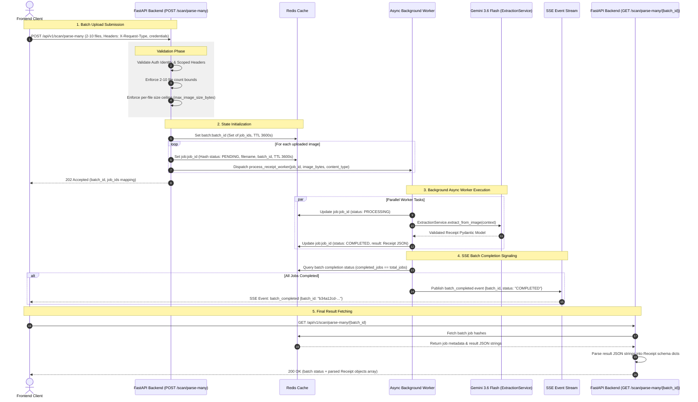

# API Specification Document

This document lists all endpoints available in **Receipt Logging Backend v1**, including HTTP methods, authentication headers, request payloads, and return schemas.

---

## Base URL & Authentication

- **Base URL**: `/api/v1`

### Header Requirements Summary

| Endpoint Category | Mandatory Headers | Payload / Mode Notes |
| :--- | :--- | :--- |
| **Public** (`/health/`, `POST /user/create`, `POST /user/login`, `POST /user/reset-password-*`, `POST /devices/register`) | *None* | No authentication required. |
| **Device / Guest** (`GET /devices/me`, `DELETE /devices/me`) | `X-Device-Name`, `X-Device-Token` | Hardware device variant name & token. |
| **User Scoped** (`GET/DELETE /user/me`, `/receipts/*`) | `X-User-Name`, `X-User-Token` | User credentials (`X-User-Token` is plaintext password, hashed server-side). |
| **Link Bridge** (`POST /devices/link`) | `X-Device-Name`, `X-Device-Token`, `X-User-Name`, `X-User-Token` | Requires **all 4 headers**. Device token removed from JSON body. |
| **Scoped** (`/scan/*`, `POST /chat/query`) | `X-Request-Type` + Mode Headers | **`X-Request-Type: "guest"`**: Requires `X-Device-Name` + `X-Device-Token` (user headers must be omitted).<br>**`X-Request-Type: "user"`**: Requires `X-User-Name` + `X-User-Token` (device headers must be omitted). |

---

## Table of Contents
1. [Scanning (`tags=["Scanning"]`)](#1-scanning-tagsscanning)
2. [Receipts (`tags=["Receipts"]`)](#2-receipts-tagsreceipts)
3. [Users (`tags=["Users"]`)](#3-users-tagsusers)
4. [Devices (`tags=["Devices"]`)](#4-devices-tagsdevices)
5. [Chat (`tags=["Chat"]`)](#5-chat-tagschat)
6. [Health (`tags=["Health"]`)](#6-health-tagshealth)
7. [Data Schemas](#7-data-schemas)

---

## 1. Scanning (`tags=["Scanning"]`)

### `POST /api/v1/scan/parse`
Extract structured receipt details from a single image synchronously using Gemini 3.6 Flash.

- **Content-Type**: `multipart/form-data`
- **Required Headers**: `X-Request-Type` (`"user"` or `"guest"`), plus mode credential headers.
- **Request Body**:
  - `image`: File (JPEG, PNG, WEBP, etc.)
- **Response Schema** (`200 OK`): `ScanResponse`
  ```json
  {
    "success": true,
    "data": {
      "merchant_name": "Target Superstore",
      "line_items": [
        {
          "description": "Organic Milk",
          "quantity": 1.0,
          "unit_price": 4.50,
          "total_price": 4.50
        }
      ],
      "subtotal": 4.50,
      "tax_amount": 0.36,
      "total_amount": 4.86,
      "currency": "USD",
      "category": "Groceries",
      "date": "2026-08-12",
      "raw_text": "...",
      "confidence_score": 0.95,
      "notes": null
    },
    "error": null
  }
  ```
- **Error Responses**:
  - `400 Bad Request` — Missing/invalid `X-Request-Type` or conflicting headers present.
  - `401 Unauthorized` — Invalid device or user authentication token.

---

### `POST /api/v1/scan/parse-many`
Submit multiple receipt files for asynchronous background parsing (2 to 10 images).

- **Content-Type**: `multipart/form-data`
- **Required Headers**: `X-Request-Type` (`"user"` or `"guest"`), plus mode credential headers.
- **Request Body**:
  - `files`: Array of Files (`UploadFile`) — **min: 2, max: 10 images**
- **Response Schema** (`202 Accepted`): `BulkJobCreateResponse`
  ```json
  {
    "batch_id": "b34a12cd-...",
    "total_jobs": 2,
    "jobs": [
      {
        "job_id": "9a12bcde-...",
        "filename": "receipt1.jpg"
      },
      {
        "job_id": "8f34cdae-...",
        "filename": "receipt2.jpg"
      }
    ]
  }
  ```
- **Error Responses**:
  - `400 Bad Request` — Fewer than 2 or more than 10 files, or a file exceeds size limit.
  - `401 Unauthorized` — Invalid credentials.

---

### `GET /api/v1/scan/parse-many/{batch_id}`
Retrieve status and extracted results for a bulk receipt parsing batch.

- **Path Parameter**: `batch_id` (string, UUID)
- **Response Schema** (`200 OK`): `BulkBatchStatusResponse`
  ```json
  {
    "batch_id": "b34a12cd-...",
    "total_jobs": 2,
    "completed_jobs": 2,
    "jobs": [
      {
        "job_id": "9a12bcde-...",
        "batch_id": "b34a12cd-...",
        "filename": "receipt1.jpg",
        "status": "COMPLETED",
        "data": {
          "merchant_name": "Target Superstore",
          "line_items": [...],
          "subtotal": 4.50,
          "tax_amount": 0.36,
          "total_amount": 4.86,
          "currency": "USD",
          "category": "Groceries",
          "date": "2026-08-12",
          "raw_text": "...",
          "confidence_score": 0.95,
          "notes": null
        },
        "error": null
      }
    ]
  }
  ```

---

### `GET /api/v1/scan/parse-many/{batch_id}/stream`
Open an SSE connection to receive live updates and full extracted batch JSON payload on completion.

- **Path Parameter**: `batch_id` (string, UUID)
- **Header or Query Auth**: `X-Device-Name` + `X-Device-Token` or query parameters `device_name` + `device_token`.
- **Emitted Event**: `batch_complete` with full `BulkBatchStatusResponse` JSON payload.

---

### Bulk Receipt Asynchronous Processing Architecture & Workflow



---

## 2. Receipts (`tags=["Receipts"]`)

### `GET /api/v1/receipts/`
Get all non-deleted receipts for the authenticated user session.

- **Required Headers**: `X-User-Name`, `X-User-Token`
- **Response Schema** (`200 OK`): `Array<ReceiptRecord>`

---

### `GET /api/v1/receipts/{receipt_id}`
Get a single receipt by ID.

- **Required Headers**: `X-User-Name`, `X-User-Token`
- **Path Parameter**: `receipt_id` (string, UUID)
- **Response Schema** (`200 OK`): `ReceiptRecord`

---

### `POST /api/v1/receipts/`
Create a single receipt record.

- **Required Headers**: `X-User-Name`, `X-User-Token`
- **Request Body**: `ReceiptCreateRequest`
  ```json
  {
    "receipt": {
      "merchant_name": "Target",
      "total_amount": 42.10,
      "currency": "USD",
      "date": "2026-08-12",
      "raw_text": "..."
    }
  }
  ```
- **Response Schema** (`201 Created`): `ReceiptRecord`

---

### `POST /api/v1/receipts/batch`
Batch-create up to 100 receipt records in a single database call.

- **Required Headers**: `X-User-Name`, `X-User-Token`
- **Request Body**: `ReceiptBatchCreateRequest`
  ```json
  {
    "receipts": [
      {
        "merchant_name": "Target",
        "total_amount": 42.10,
        "currency": "USD",
        "date": "2026-08-12",
        "raw_text": "..."
      }
    ]
  }
  ```
- **Response Schema** (`201 Created`): `Array<ReceiptRecord>`

---

### `DELETE /api/v1/receipts/{receipt_id}`
Soft-delete a receipt record by ID.

- **Required Headers**: `X-User-Name`, `X-User-Token`
- **Response Schema** (`200 OK`):
  ```json
  {
    "success": true,
    "receipt_id": "..."
  }
  ```

---

## 3. Users (`tags=["Users"]`)

### `POST /api/v1/user/create`
Register a new user account.

- **Request Body**: `UserCreateRequest`
  ```json
  {
    "username": "johndoe",
    "email": "johndoe@example.com",
    "password": "my_secret_password",
    "country_code": "+60",
    "mobile_number": "123456789",
    "avatar_image_path": null
  }
  ```
- **Response Schema** (`201 Created`): `UserRecord`

---

### `POST /api/v1/user/login`
Authenticate user credentials using username or email.

- **Request Body**: `UserLoginRequest`
  ```json
  {
    "username": "johndoe",
    "password": "my_secret_password"
  }
  ```
- **Response Schema** (`200 OK`): `UserLoginResponse`

---

### `GET /api/v1/user/me`
Get current user profile.

- **Required Headers**: `X-User-Name`, `X-User-Token`
- **Response Schema** (`200 OK`): `UserRecord`

---

### `PATCH /api/v1/user/me`
Update user profile fields (email, country code, mobile number, avatar).

- **Required Headers**: `X-User-Name`, `X-User-Token`
- **Request Body**: `UserUpdateRequest`
- **Response Schema** (`200 OK`): `UserRecord`

---

### `DELETE /api/v1/user/me`
Soft-delete current user account.

- **Required Headers**: `X-User-Name`, `X-User-Token`
- **Response Schema** (`200 OK`):
  ```json
  {
    "success": true,
    "message": "User profile soft-deleted successfully."
  }
  ```

---

### Password Reset Flow (`/user/reset-password-*`)

1. **`POST /api/v1/user/reset-password-initiate`**: Accepts `identifier` (email or mobile), generates a 6-digit OTP (logged in dev environment).
2. **`POST /api/v1/user/reset-password-verify-otp`**: Accepts `identifier` + `otp`, returns single-use `reset_token`.
3. **`POST /api/v1/user/reset-password-new`**: Accepts `reset_token` + `new_password`, updates user password.

---

## 4. Devices (`tags=["Devices"]`)

### `POST /api/v1/devices/register`
Register or update a hardware device.

- **Request Body**: `DeviceRegisterRequest`
  ```json
  {
    "device_name": "MS700-AAAA",
    "device_token": "secret_token_12345678",
    "username": null
  }
  ```
- **Response Schema** (`201 Created`): `DeviceRecord`

---

### `GET /api/v1/devices/me`
Retrieve calling device details.

- **Required Headers**: `X-Device-Name`, `X-Device-Token`
- **Response Schema** (`200 OK`): `DeviceRecord`

---

### `POST /api/v1/devices/link`
Link or unlink a device to/from a user account.

- **Required Headers**: **ALL 4 REQUIRED** (`X-Device-Name`, `X-Device-Token`, `X-User-Name`, `X-User-Token`)
- **Request Body**: `DeviceLinkRequest`
  ```json
  {
    "device_name": "MS700-AAAA",
    "username": "johndoe"
  }
  ```
- **Response Schema** (`200 OK`): `DeviceRecord`

---

### `DELETE /api/v1/devices/me`
Soft-delete calling device registration.

- **Required Headers**: `X-Device-Name`, `X-Device-Token`
- **Response Schema** (`200 OK`):
  ```json
  {
    "success": true,
    "device_name": "MS700-AAAA"
  }
  ```

---

### `POST /api/v1/devices/rotate-token`
Rotate the secret `device_token` for an authenticated device.

- **Required Headers**: `X-Device-Name`, `X-Device-Token` (current token)
- **Request Body**: `DeviceTokenRotateRequest`
  ```json
  {
    "new_device_token": "token_new_uuid_12345678"
  }
  ```
- **Response Schema** (`200 OK`): `DeviceRecord`

---

## 5. Chat (`tags=["Chat"]`)

### `POST /api/v1/chat/create`
Create a new AI chat conversation in Supabase cloud store.

- **Required Headers**: `X-User-Name`, `X-User-Token`
- **Request Body**: `ConversationCreateRequest` (`{"title": "..."}`)
- **Response Schema** (`201 Created`): `ConversationRecord`

---

### `GET /api/v1/chat/list`
List conversations owned by the caller's user identity.

- **Required Headers**: `X-User-Name`, `X-User-Token`
- **Query Parameters**: `limit` (default: 20), `offset` (default: 0)
- **Response Schema** (`200 OK`): `Array<ConversationRecord>`

---

### `GET /api/v1/chat/history`
Fetch paginated message history for a conversation.

- **Required Headers**: `X-User-Name`, `X-User-Token`
- **Query Parameters**: `conversation_id` (required), `limit`, `offset`
- **Response Schema** (`200 OK`): `ChatHistoryResponse`

---

### `POST /api/v1/chat/query`
Send message to Gemini 3.6 Flash with **Multi-Store Support** (Cloud vs Local).

- **Required Headers**: `X-Request-Type` (`"user"` or `"guest"`), plus mode credential headers.
- **Request Body**: `ChatQueryRequest`
  ```json
  {
    "conversation_id": null,
    "message": "How much did I spend on coffee this month?",
    "conversation_history": [
      { "role": "user", "content": "Hi" },
      { "role": "assistant", "content": "Hello! How can I help you?" }
    ],
    "recent_receipts": [
      {
        "merchant_name": "Starbucks",
        "total_amount": 5.50,
        "category": "Food & Drink",
        "date": "2026-08-10"
      }
    ]
  }
  ```

#### Storage Modes:
1. **Cloud Store Mode** (`conversation_id` provided):
   - Requires `X-Request-Type: user`.
   - Fetches history from Supabase DB, calls Gemini 3.6 Flash, persists user & assistant messages to Supabase DB.
2. **Local Store Mode** (`conversation_id` null/omitted):
   - Supports both **Guest** (`X-Request-Type: guest`) and **User local** (`X-Request-Type: user`).
   - **Zero Supabase DB reads or writes**.
   - Uses client-supplied `conversation_history` (max 20 turns) and `recent_receipts` (max 50 items) for RAG context.
   - Returns synthetic UUIDs for `user_message` and `assistant_message` so mobile clients can save locally to Isar DB.

- **Response Schema** (`200 OK`): `ChatQueryResponse`
  ```json
  {
    "conversation_id": null,
    "user_message": {
      "id": "e3b0c442-...",
      "conversation_id": null,
      "sender": "user",
      "content": "How much did I spend on coffee this month?",
      "created_at": "2026-08-12T17:30:00Z"
    },
    "assistant_message": {
      "id": "f4c1d553-...",
      "conversation_id": null,
      "sender": "assistant",
      "content": "Based on your local receipts, you spent $5.50 at Starbucks on 2026-08-10.",
      "created_at": "2026-08-12T17:30:01Z"
    }
  }
  ```

---

### `DELETE /api/v1/chat/{conversation_id}`
Soft-delete a conversation.

- **Required Headers**: `X-User-Name`, `X-User-Token`
- **Response Schema** (`200 OK`):
  ```json
  {
    "success": true,
    "conversation_id": "..."
  }
  ```

---

## 6. Health (`tags=["Health"]`)

### `GET /api/v1/health/`
Check backend server health status.

- **Response Schema** (`200 OK`): `HealthResponse`
  ```json
  {
    "status": "healthy",
    "environment": "production",
    "version": "1.0.0"
  }
  ```

---

## 7. Data Schemas

### `Receipt`
| Field | Type | Required | Description |
| :--- | :--- | :--- | :--- |
| `merchant_name` | string | Yes | Name of store/vendor |
| `line_items` | Array<LineItem> | No | Extracted itemized purchases |
| `subtotal` | float | No | Subtotal amount |
| `tax_amount` | float | No | Tax amount |
| `total_amount` | float | Yes | Total paid amount |
| `currency` | string | Yes | Default `"USD"` |
| `category` | string | No | Expense category |
| `date` | string / datetime | Yes | Purchase date |
| `raw_text` | string | Yes | Raw OCR/parsed text |
| `confidence_score` | float | Yes | Validation confidence (0.0 - 1.0) |
| `notes` | string | No | Optional notes |

### `LineItem`
| Field | Type | Required | Description |
| :--- | :--- | :--- | :--- |
| `description` | string | Yes | Item description |
| `quantity` | float | No | Item quantity |
| `unit_price` | float | No | Price per unit |
| `total_price` | float | No | Total price for line item |

### `ChatMessageInput`
| Field | Type | Required | Description |
| :--- | :--- | :--- | :--- |
| `role` | string | Yes | Message sender role (`"user"` or `"assistant"`) |
| `content` | string | Yes | Text content (1 to 4000 characters) |

### `ReceiptContextItem`
| Field | Type | Required | Description |
| :--- | :--- | :--- | :--- |
| `merchant_name` | string | Yes | Merchant name |
| `total_amount` | float | Yes | Total expense amount |
| `category` | string | No | Expense category |
| `date` | string | No | Expense date (YYYY-MM-DD) |

### `ChatQueryRequest`
| Field | Type | Required | Description |
| :--- | :--- | :--- | :--- |
| `conversation_id` | string \| null | No | Supabase conversation UUID. Null/omitted for local store mode |
| `message` | string | Yes | User message query (1 to 4000 characters) |
| `conversation_history` | Array<ChatMessageInput> | No | Prior conversation turns for local/guest mode (max 20) |
| `recent_receipts` | Array<ReceiptContextItem> | No | Local receipts for AI spending analysis RAG context (max 50) |
